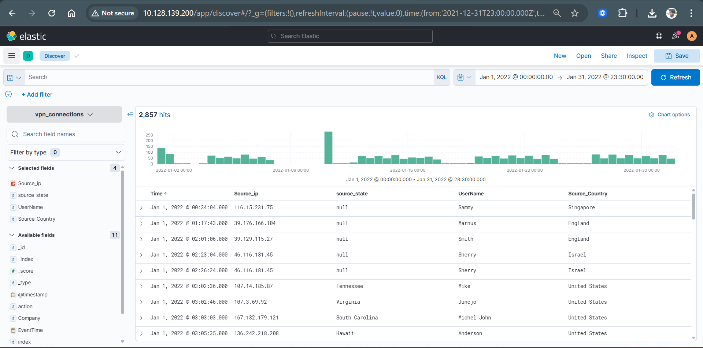
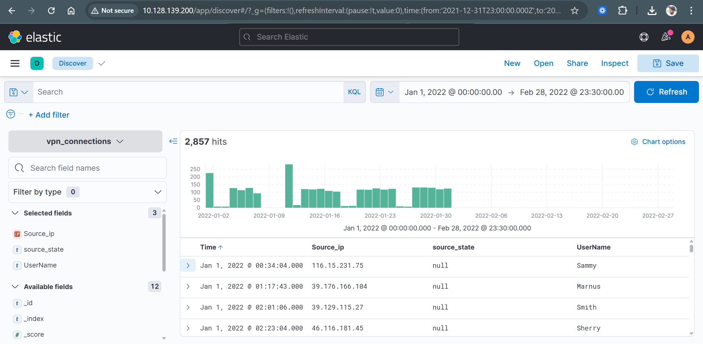
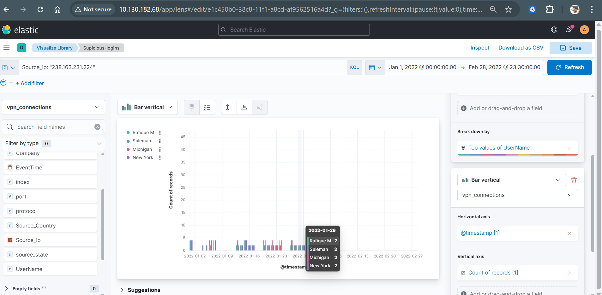
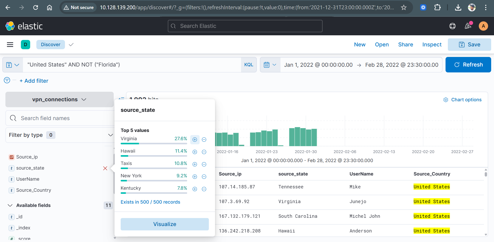
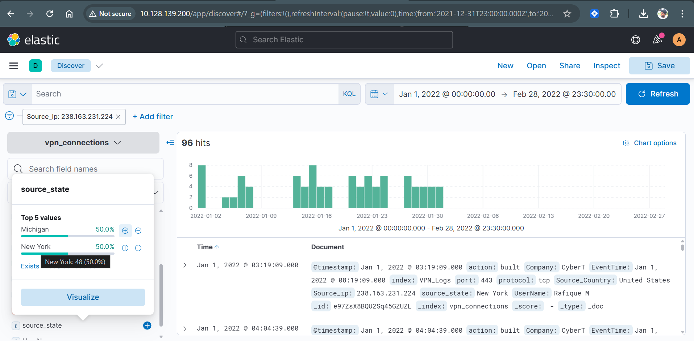
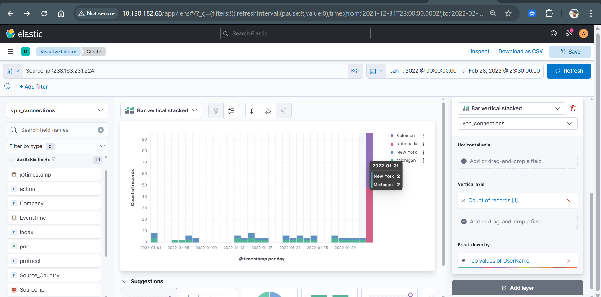
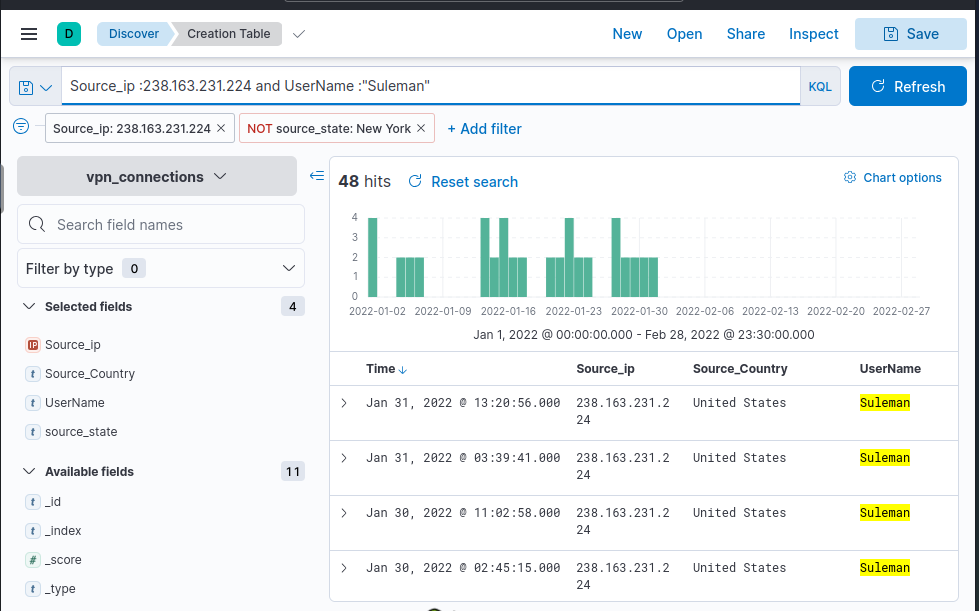
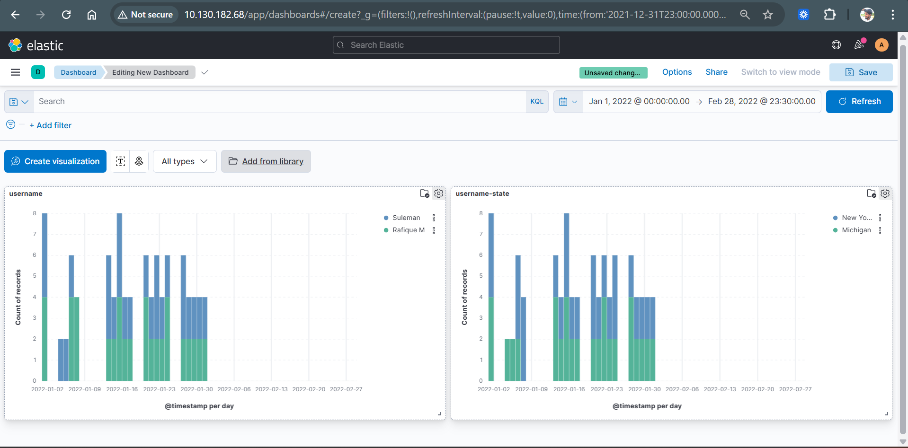

# ELK SIEM Investigation: Suspicious Login Analysis


----
## Executive Summary

Analysis of VPN authentication logs identified a suspicious IP (238.163.231.224) used by multiple users across different geographic locations with missing location data. The activity pattern suggests potential VPN/proxy usage or credential sharing, with repeated login behavior observed over time. This activity is anomalous and requires further monitoring and investigation.

---

## Project Overview

This project demonstrates a **SIEM investigation** using the **ELK Stack (Elasticsearch, Logstash, Kibana)**.

The objective was to analyze VPN authentication logs, identify anomalous login behavior, and perform a structured investigation similar to a **SOC analyst workflow**.

---

## Data Scope

- Time range: Jan 1, 2022 – Feb 28, 2022  
- Log source: VPN authentication logs  
- Total events analyzed: ~2,800+

---

## Objective

* Detect suspicious login activity
* Correlate multiple data sources (IP, user, location, time)
* Identify potential misuse:

  * VPN/proxy usage
  * Credential sharing
  * Anomalous access patterns

---

## Tools & Technologies

* Elasticsearch
* Kibana (Discover, Lens, Dashboard)
* KQL (Kibana Query Language)
* TryHackMe SIEM Lab

---

## Investigation Methodology

This investigation followed a structured SOC-style workflow to identify and validate suspicious login behavior.

---

### 1️. Log Exploration (Initial Triage)

* Used **Kibana Discover** to analyze raw VPN authentication logs
* Reviewed key fields:

  * `Source_ip`
  * `UserName`
  * `source_state`
  * `@timestamp`
* Observed unusual patterns such as repeated IP usage and missing location data

---

### 2️. Filtering & Querying

Applied **KQL (Kibana Query Language)** to isolate suspicious activity:

```kql
Source_ip: "238.163.231.224"
```

```kql
UserName: "Suleman" OR "Rafique M"
```

```kql
NOT source_state : *
```

* Identified a suspicious IP associated with multiple users
* Detected missing geographic information (possible anonymization)

---

### 3️. Correlation Analysis

Correlated multiple data points to uncover relationships:

* **IP ↔ Users** → Same IP used by multiple accounts
* **IP ↔ Locations** → Activity across different states
* **Activity ↔ Time** → Repeated login patterns

This step confirmed anomalous behavior patterns.

---

### 4️. Visualization & Pattern Analysis

Built visualizations using **Kibana Lens**:

* User activity over time
* Geographic distribution of logins
* Detection of spikes and anomalies

Identified a noticeable increase in login activity in late January.

---

### 5️. Targeted Investigation (User + IP Correlation)

Performed focused analysis using combined filters:

```kql
Source_ip: "238.163.231.224" AND UserName: "Suleman"
```

* Confirmed repeated login activity from the same IP
* Observed consistent behavior patterns
* Strengthened correlation between suspicious entities

---

### 6️. Hypothesis & Validation

Based on findings, the following scenarios were evaluated:

* VPN or proxy usage
* Credential sharing
* Potential unauthorized access

All hypotheses were supported through log correlation and visualization evidence.
No evidence of brute-force attempts was observed, suggesting the activity is more consistent with valid credential usage rather than password attacks.
---

## Key Findings

- Suspicious IP: **238.163.231.224**
- Users involved: **Suleman, Rafique M**
- Locations observed: **Michigan, New York**
- Missing geolocation data in multiple records

The same IP address was used across multiple accounts and locations, strongly indicating anonymization (VPN/proxy) or credential sharing.

----

### Suspicious IP

**238.163.231.224**

### Users

* Suleman
* Rafique M

### Locations

* Michigan
* New York

This behavior is anomalous and may indicate account misuse or anonymized access. 
It should be escalated for further investigation and continuous monitoring.
---

## Suspicious Indicators

* Same IP used by multiple users
* Same IP across different locations
* Missing `source_state` values
* Spike in activity (late January)

---

## Visual Evidence

### Log Analysis (Discover)


Initial log exploration using Kibana Discover to inspect raw VPN authentication logs. 
This view helped identify key fields such as IP address, username, and geographic data, 
which guided further investigation.

---
### Missing Location Data (Anomaly Indicator)


A significant portion of logs contained missing `source_state` values. 
This may indicate anonymized traffic (VPN/proxy) or incomplete logging, 
which strengthens the hypothesis of suspicious activity.

---

### User Activity Over Time


Time-based analysis of user login activity using @timestamp. 
This visualization highlights patterns and spikes in authentication events, 
helping identify abnormal behavior.

---

### Location Analysis


Geographic distribution of login activity across multiple states (Michigan and New York), which is unusual for a single source IP and indicates potential anomalous access patterns.

---

### Source IP Consistency


All observed suspicious activity originates from a single IP address (238.163.231.224), 
confirming a strong correlation between events and reinforcing the investigation focus.

---

### Correlation Insight


A significant number of records contained missing location data (`source_state`), suggesting possible anonymization or logging gaps.
Correlation between IP address, users, and locations shows that a single IP is associated with multiple users across different geographic regions.
This visualization reveals that a single IP is associated with multiple users 
and geographic locations, indicating suspicious behavior.

---

### Targeted Investigation (User + IP Correlation)


The same IP address (238.163.231.224) was used by multiple users, indicating potential credential sharing or VPN usage.
Focused analysis using combined filters (Source_ip + UserName). 
This confirms repeated login activity from the same IP for a specific user, 
strengthening the investigation findings.

---

## Investigation Dashboard



This dashboard provides a consolidated view of the investigation, combining user activity, geographic distribution, and temporal patterns.

It enables quick identification of anomalies, including repeated login behavior from the same IP across multiple users and locations.

Filters were applied dynamically to isolate individual users (e.g., Suleman and Rafique M) for deeper investigation and validation.

---

## Limitations

- No endpoint telemetry available to validate user activity
- Missing `source_state` reduces geolocation accuracy
- No MFA or device-level data for identity validation

---

## Security Analysis

The behavior suggests:

* Shared IP usage across accounts
* Multi-location access patterns
* Possible VPN/proxy usage or credential sharing

This behavior is anomalous and may indicate account misuse or anonymized access. 
It should be escalated for further investigation and continuous monitoring.

## MITRE ATT&CK Mapping

- T1078 – Valid Accounts  
  Evidence: Multiple users authenticated from the same IP address

- T1090 – Proxy  
  Evidence: Missing geographic data and multi-location activity suggesting VPN/proxy usage

---

## SOC Analyst Perspective

This activity would trigger:

* Medium–High severity alert
* Further investigation:

  * Authentication logs
  * Endpoint activity
  * Network correlation

---

## Project Demo

This video demonstrates the SIEM investigation process using Kibana, including log analysis, anomaly detection, and data visualization.

The demo highlights:
- Identification of a suspicious IP address
- Correlation between multiple users and geographic locations
- Detection of missing location data (possible VPN/proxy usage)
- Visualization of login patterns and anomalies using Kibana Lens
- Dashboard creation for SOC-style monitoring and analysis
Note: The investigation follows a structured SOC workflow from raw log analysis to correlation and visualization.

👉 https://drive.google.com/file/d/1yL8QmpZxD17QAE3T9bjO2bKj-mEb2ZeZ/view?usp=drive_link

---

## Detection Recommendation

To detect similar activity in a real SOC environment:

- Alert on multiple users logging in from the same IP
- Detect login activity from different geographic locations within short timeframes
- Flag events with missing or null geolocation fields

---


## Future Improvements

* SIEM alert rules
* Impossible travel detection
* Brute-force detection
* Threat intelligence integration

---

## Skills Demonstrated

* SIEM investigation
* Log correlation
* Threat detection
* Kibana visualization
* KQL querying
* SOC methodology

---

## Author

**Shravan**
Cybersecurity Master's Student – EPITA (Paris, France 🇫🇷)
Aspiring SOC Analyst

## Connect with Me
Actively seeking **SOC Analyst / Cybersecurity Internships in Europe 🇪🇺**
[LinkedIn – Shravan Chanda](https://www.linkedin.com/in/shravan-chanda-87280a206/)
